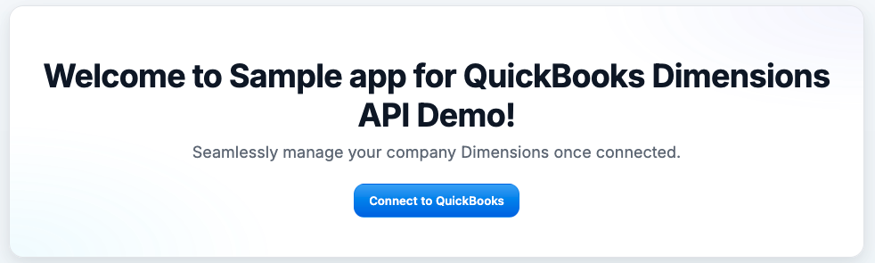
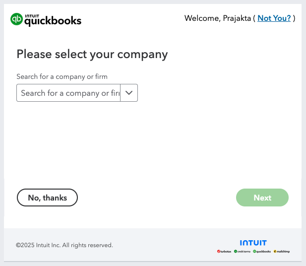
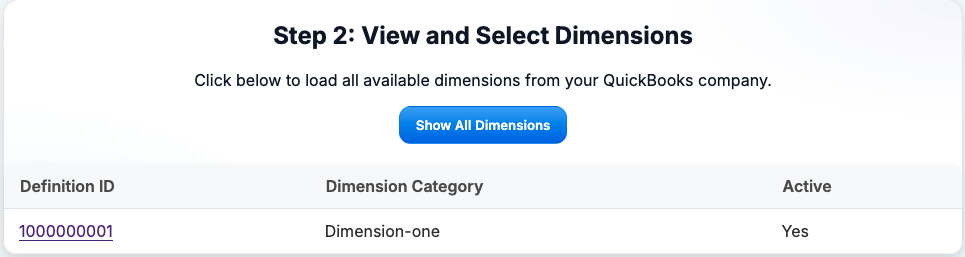
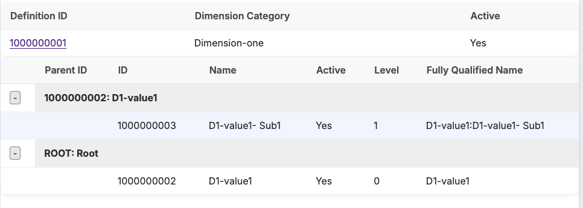
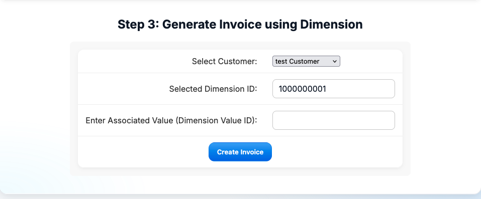
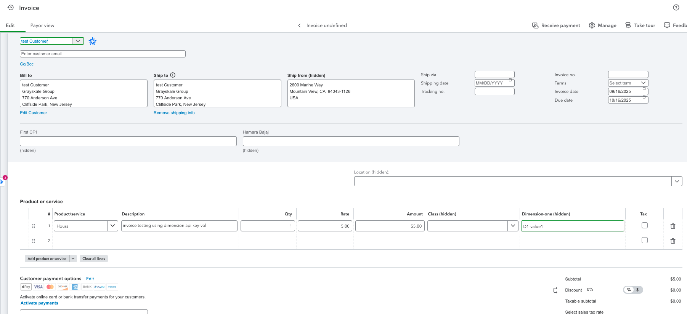

# sampleapp-dimensions-nodejs
# Dimensions API Demo Application
Dimensions are user-defined categories that you can use to track aspects of accounting data in Intuit Enterprise Suite, such as department, product line, site, and location. Dimensions provide a way to categorize transactions and financial data. You can use dimensions to filter and group data in reports, and to create custom reports that show data the way you want to see it. This application demonstrates how to connect to QuickBooks Online, view and drill down into custom dimensions, and generate invoices using dimension data. It is built with Node.js, Express, and the QuickBooks Online APIs.

## Core Concepts Demonstrated
This application demonstrates the following key concepts for working with Intuit Enterprise Suite (IES) and the Dimensions API:

- **OAuth 2.0 Authentication:** Securely connect to QuickBooks/IES using industry-standard OAuth 2.0 flows.
- **Custom Dimensions:** Retrieve, display, and drill down into user-defined categories (dimensions) that help organize and analyze accounting data (e.g., department, product line, site, location).
- **Dimension Values:** Fetch and validate dimension values for a selected dimension definition, ensuring correct data entry for transactions.
- **Invoice Creation with Dimensions:** Generate invoices that are associated with specific dimension values, demonstrating how to use dimensions in real business workflows.
- **Customer Selection:** Dynamically load and select customers from QuickBooks for invoice creation.
- **Stepwise User Experience:** The UI guides users through connecting, exploring dimensions, and generating invoices in a clear, step-by-step manner.

## Table of Contents

- [Features](#features)
- [Prerequisites](#prerequisites)
- [Installation](#installation)
- [Configuration](#configuration)
- [Running the Application](#running-the-application)
- [Usage](#usage)
- [Project Structure](#project-structure)
- [Troubleshooting](#troubleshooting)
- [Support](#support)

---

## Features

- **OAuth 2.0 Authentication** with QuickBooks Online
- **View all custom dimensions** and drill down by parent-child relationships
- **Generate invoices** using selected dimensions and customers
- **Customer selection** via dropdown populated from QuickBooks
- **Invoice details** and QBO deeplink after creation

---

## Prerequisites

- Node.js v18 or newer (recommended for built-in `fetch` support)
- npm (Node Package Manager)
- QuickBooks Online developer account and IES company for API access
- QuickBooks OAuth 2.0 credentials (Client ID, Client Secret, Redirect URI)
- [ngrok](https://ngrok.com/) (optional, for local development with webhooks/callbacks)

---

## Installation

1. **Clone the repository:**
   ```bash
   git clone <your-repo-url>
   cd sampleapp-dimensions-nodejs
   ```

2. **Install dependencies:**
   ```bash
   npm install
   ```

---

## Configuration

1. **Create a `.env` file in the project root:**
   ```
   PORT=3000
   ENVIRONMENT=production # or sandbox, currently IES companies are only available in production
   QBO_CLIENT_ID=your_qbo_client_id
   QBO_CLIENT_SECRET=your_qbo_client_secret
   QBO_REDIRECT_URI=https://your-ngrok-url-or-localhost/api/auth/callback
   ```

2. **Set up QuickBooks OAuth App:**
   - Go to [Intuit Developer Portal](https://developer.intuit.com/)
   - Create an app and get your Client ID, Client Secret, and Redirect URI
   - Add your Redirect URI to the app settings

3. **(Optional) Set up ngrok for local development:**
   ```bash
   ngrok http 3000
   ```
   Use the generated HTTPS URL as your Redirect URI.

---

## Running the Application

1. **Start the server:**
   ```bash
   npm start
   ```
   or
   ```bash
   node index.js
   ```

2. **Open your browser:**
   ```
   http://localhost:3000/
   ```
   or your ngrok URL.

---

## Usage

### 1. **Connect to QuickBooks**
   - Click the "Connect to QuickBooks" button.
   - Select the IES company to connect. (You must have an IES company for this demo.)
   - Complete the OAuth flow and authorize the app.

### 2. **View Dimensions**
   - Click "Show all dimensions" to view all available dimensions.
   - Click any Definition ID to drill down into its values.

### 3. **Generate Invoice**
   - After clicking a Definition ID, the invoice form appears.
   - Select a customer from the dropdown.
   - Enter the Associated Value (Dimension Value ID).
   - Click "Create" to generate an invoice.
   - After creation, you’ll see the invoice ID, a QBO deeplink, transaction date, customer name, and total amount.

---

## Project Structure

```
sampleapp-dimensions-nodejs/
├── public/
│   ├── js/
│   │   └── main.js         # Main client-side JS
│   ├── styles.css
├── pages/
│   └── index.html          # Main HTML page
├── routes/
│   ├── dimension.js        # Dimension & invoice routes
│   ├── customer.js         # Customer API route
│   └── oauth.js            # OAuth routes
├── services/
│   ├── dimension-service.js
│   └── auth-service.js
├── index.js                # Express server entry point
├── .env                    # Environment variables
└── README.md
```

---

## Relevant API Reference Documentation

- [Intuit Enterprise Suite (IES)](https://www.intuit.com/enterprise/)
- [Developing for Intuit Enterprise Suite (IES)](https://developer.intuit.com/app/developer/ies/docs/get-started)
- [Dimensions API (supported for IES)](https://developer.intuit.com/app/developer/ies/docs/workflows/manage-dimensions)

---

## Visual Overview









---

## Troubleshooting

- **OAuth issues:** Double-check your Redirect URI and credentials in `.env`.
- **Token issues:** Ensure your token is being stored and refreshed correctly.
- **API errors:** Check logs for error details; verify your company ID and API permissions.
- **Static file errors:** Ensure your JS and CSS files are in the correct folders and referenced properly in HTML.
- **500 errors on customer fetch:** Make sure your OAuth token is valid and not expired.

---

## Support

If you encounter issues or have questions, please open an issue in the repository or contact the maintainer.

---

**Enjoy exploring QuickBooks Dimensions and Invoice APIs!**